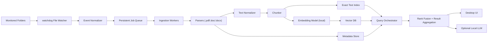

# Engineering Architecture Plan

## Product
Shelf

## Purpose

This document defines the target technical architecture for Shelf based on the product plan in [product_plan.md](/Users/adityadroid/VSCodeProjects/ai/shelf/docs/product_plan.md). The design is optimized for the following hard constraints:

- 100% offline execution on macOS.
- Python as the primary application language.
- Real-time event-driven indexing of local folders.
- A local Retrieval-Augmented Generation architecture built on a vector database.
- Only free libraries, models, databases, and tools.
- No mandatory subscriptions, no hosted APIs, and no cloud dependencies.

The recommended architecture is intentionally hybrid: vector search powers semantic retrieval, while a local exact-text index handles filename and keyword precision. This avoids forcing all queries through embeddings and produces better UX for document search.

## System Architecture Overview

Shelf should be implemented as a local macOS desktop application with a Python application core and a small number of clearly separated subsystems:

- Desktop UI layer.
- Folder configuration and permissions manager.
- File watcher and event ingestion subsystem.
- Document parsing and normalization subsystem.
- Chunking and embedding pipeline.
- Metadata store and exact-text search index.
- Vector database for semantic retrieval.
- Query orchestrator for hybrid search and optional local RAG generation.

At runtime, the system behaves as follows:

1. The app starts and loads configured monitored folders from local settings.
2. A file system listener subscribes to changes in those folders.
3. File events are normalized into jobs and pushed into a persistent local event queue.
4. Background workers consume jobs, parse supported files, chunk extracted text, generate embeddings locally, and write metadata plus vectors to local storage.
5. When the user searches, the query layer executes:
   exact-text search over metadata and content index,
   semantic vector similarity search over chunk embeddings,
   rank fusion over both result sets,
   document-level aggregation for display.
6. If a future feature enables summaries or answer generation, the same retrieved chunks can be passed to a fully local LLM without any network calls.

The architecture should be designed so that every storage and compute dependency lives inside the app sandbox or a user-owned local app data directory.

## Logical Architecture

## Proposed Technology Stack

## Core Application

- Python 3.11+
  Reason: modern async support, good packaging ecosystem, strong library availability.
- PySide6
  Reason: free under LGPL, mature desktop UI toolkit, good macOS support, no subscription or paid runtime.

## File Watching and Background Execution

- `watchdog`
  Reason: free, cross-platform Python file system monitoring library with macOS support.
- Python standard library: `asyncio`, `queue`, `threading`, `concurrent.futures`, `sqlite3`
  Reason: enough to build a reliable bounded worker system without adding queue infrastructure.

## Document Parsing

- `pypdf`
  Reason: pure-Python PDF text extraction, free, good baseline for text PDFs.
- `python-docx`
  Reason: robust local extraction from `.docx`.
- `antiword` local CLI tool for `.doc`
  Reason: free, lightweight, local, purpose-built for legacy Word documents. Invoke from Python using `subprocess`.

## Chunking and Embeddings

- `sentence-transformers`
  Reason: fully local embeddings, free pre-trained models, easy Python integration.
- Default embedding model: `sentence-transformers/all-MiniLM-L6-v2`
  Reason: free, small, fast enough for laptop inference, widely used for semantic retrieval.
- Optional acceleration: `onnxruntime` or `onnxruntime-silicon`
  Reason: free local inference acceleration on supported macOS hardware.

## Vector Storage

- ChromaDB
  Reason: free, embedded, Python-native, easy local persistence, well suited for a desktop app with no separate database service.

Alternative:

- Qdrant local mode via `qdrant-client`
  Reason: also free and strong for vector search, but ChromaDB is simpler for MVP because it reduces operational moving parts in a local desktop application.

## Metadata and Exact Search

- SQLite with FTS5
  Reason: free, embedded, already available on macOS, excellent fit for local metadata storage plus exact/keyword search.

## Optional Local LLM Layer

- Ollama
  Reason: free local inference runner, no subscription required, easy model management for future answer/summarization features.
- Suggested optional local models for future phases:
  - `llama3.2:3b`
  - `phi3:mini`
  - any other fully local GGUF-compatible small model the team validates

This layer should be optional and disabled in MVP because the product plan keeps AI summaries and Q&A out of MVP scope.

## Packaging and Distribution

- `pyinstaller` or `briefcase`
  Reason: both are free options for bundling Python desktop apps for macOS.

## Observability

- Python `logging`
- Structured JSON logs written locally
- Simple local metrics tables in SQLite

No remote telemetry should exist in MVP.

## Recommended Storage Layout

All data should live in a local application support directory, for example:

- App settings: monitored folders, user preferences
- SQLite database: metadata, job queue, scan state, FTS index
- Chroma persistent store: embeddings and chunk payload metadata
- Model cache: embedding models and optional local LLM models
- Log files: rotating local logs only

Example conceptual layout:

- `~/Library/Application Support/Shelf/config/`
- `~/Library/Application Support/Shelf/db/`
- `~/Library/Application Support/Shelf/vectors/`
- `~/Library/Application Support/Shelf/models/`
- `~/Library/Application Support/Shelf/logs/`

## Component Design

## 1. File Watcher & Event Queue

### Responsibilities

- Subscribe to file system events for all monitored folders.
- Detect creates, modifies, moves, renames, and deletes in real time.
- Debounce noisy event bursts from applications that save files in multiple steps.
- Convert raw watcher events into normalized indexing jobs.
- Persist those jobs locally so events are not lost if the app crashes.

### Design

The file watcher should use `watchdog.Observer` with one recursive watch per monitored folder. Raw file system events should not trigger parsing directly. Instead, they flow through a normalization layer that:

- resolves the absolute path,
- checks whether the extension is supported,
- classifies the operation as `UPSERT`, `DELETE`, or `MOVE`,
- coalesces multiple events for the same path within a short debounce window,
- writes one durable job record into a local SQLite-backed queue table.

Recommended queue table:

- `jobs`
  - `job_id`
  - `event_type`
  - `path`
  - `old_path`
  - `folder_id`
  - `priority`
  - `status`
  - `attempt_count`
  - `next_attempt_at`
  - `created_at`
  - `updated_at`
  - `fingerprint_hint`

### Why a persistent queue is required

- `watchdog` can emit duplicate events.
- document parsing and embedding may take seconds.
- app restarts must not lose outstanding work.
- battery-aware throttling requires deferred execution, not immediate processing on the watcher thread.

### Processing Model

- One lightweight watcher thread per observer group.
- One event normalizer thread or async task.
- A bounded worker pool for ingestion jobs.
- A small in-memory dedupe map keyed by file path plus mtime/size.

### Failure Handling

- If parsing fails, the job is retried with exponential backoff.
- If a file disappears before processing, convert the job to a delete reconciliation.
- If the queue grows too large, the system should collapse duplicate pending jobs for the same path before worker execution.

### Startup Reconciliation

File system watchers are not enough by themselves. At app startup, Shelf should run a reconciliation scan of monitored folders to catch:

- events missed while the app was closed,
- files added by external sync tools,
- deleted files not previously observed,
- metadata drift between storage and disk state.

This reconciliation should compare current disk state against indexed fingerprints and enqueue deltas instead of forcing a full rebuild.

## 2. Document Ingestion & Parsing

### Responsibilities

- Validate eligibility of files before spending CPU on them.
- Extract text and metadata locally.
- Normalize content into a consistent internal representation.
- Emit parser diagnostics for unreadable or partially readable files.

### Supported Parsers

#### PDF

- Library: `pypdf`
- Strategy:
  - open file in read-only mode,
  - iterate pages,
  - extract text page by page,
  - keep page boundaries in metadata for snippet generation,
  - if extraction yields near-empty text, mark the document as `NO_TEXT_EXTRACTED`.

#### DOCX

- Library: `python-docx`
- Strategy:
  - extract paragraphs, headers, and table text where practical,
  - normalize whitespace and paragraph boundaries,
  - preserve basic section structure in metadata for chunking.

#### DOC

- Tool: `antiword`
- Strategy:
  - invoke `antiword` through `subprocess.run`,
  - capture stdout as extracted text,
  - time-box execution and handle non-zero exit codes safely,
  - mark parser status if extraction is partial or unsupported.

### Internal Document Model

Every parsed file should be transformed into a normalized document object:

- `document_id`
- `path`
- `file_name`
- `extension`
- `size_bytes`
- `ctime`
- `mtime`
- `checksum` or content fingerprint
- `parser_type`
- `parser_status`
- `raw_text`
- `text_length`
- `page_count` if available
- `last_indexed_at`

### Fingerprinting Strategy

To avoid unnecessary reprocessing, each file should have a stable change fingerprint:

- primary fast fingerprint:
  - absolute path
  - size
  - mtime nanoseconds
- optional deep fingerprint for changed candidates:
  - SHA-256 hash of the file bytes

Use fast fingerprinting for queue dedupe and use deep fingerprinting only when required to confirm real content changes.

## 3. Chunking & Embedding Pipeline

### Responsibilities

- Convert parsed document text into semantically meaningful chunks.
- Generate embeddings locally without blocking the UI.
- Preserve enough metadata for later result aggregation and highlighting.

### Chunking Strategy

Use a deterministic chunker with overlap. Recommended initial policy:

- target chunk size: 500 to 800 characters or 150 to 250 tokens equivalent,
- overlap: 75 to 120 characters,
- prefer breaking on paragraph boundaries,
- preserve page number or section origin when available.

Each chunk should include:

- `chunk_id`
- `document_id`
- `chunk_index`
- `text`
- `page_start`
- `page_end`
- `char_start`
- `char_end`
- `token_estimate`
- `embedding_model_version`

### Why not embed whole documents

- long documents dilute semantic relevance,
- chunk retrieval improves search precision,
- future RAG answer generation depends on chunk-level retrieval,
- incremental reindexing can update only the affected chunks.

### Embedding Pipeline Design

- Load one embedding model instance per worker process or a single shared worker depending on profiling.
- Use micro-batches, for example 8 to 32 chunks per embedding call.
- Persist chunk text and metadata before embedding so crashes do not force reparsing.
- Write vectors to Chroma only after embeddings are successfully created.
- Record the model name and embedding schema version per chunk to support future re-embeds.

### Recommended Default Embedding Configuration

- library: `sentence-transformers`
- model: `all-MiniLM-L6-v2`
- execution mode:
  - CPU default
  - Apple Silicon acceleration if validated locally

### Re-Embedding Policy

Re-embedding must occur when:

- chunk text changes,
- embedding model changes,
- chunking parameters change,
- schema version changes.

The system should support background re-embedding as a low-priority maintenance task.

## 4. Vector Storage & Querying

### Responsibilities

- Persist embeddings locally.
- Support nearest-neighbor similarity search for query embeddings.
- Return chunk-level matches with metadata suitable for aggregation into document results.

### ChromaDB Design

Use one persistent Chroma collection for searchable document chunks.

Suggested fields:

- ID: `chunk_id`
- document:
  - raw chunk text
- metadata:
  - `document_id`
  - `path`
  - `file_name`
  - `extension`
  - `chunk_index`
  - `mtime`
  - `page_start`
  - `page_end`
  - `parser_status`
  - `embedding_model_version`

### Exact Search in Parallel

Vector search alone is not sufficient for a desktop document finder. Shelf should execute exact retrieval in SQLite FTS5 in parallel for:

- filenames,
- file paths,
- raw extracted content,
- possibly boosted recent documents.

This hybrid design improves:

- exact keyword recall,
- filename match quality,
- rare term retrieval,
- short query handling.

### Hybrid Ranking Strategy

Recommended first implementation:

1. Run FTS query in SQLite.
2. Embed the user query locally.
3. Run top-k vector similarity search in Chroma.
4. Normalize scores from both systems.
5. Merge by `document_id`.
6. Apply weighted rank fusion.
7. Return the top documents with best matching chunks attached.

Suggested initial weights:

- exact filename match: highest boost
- FTS content score: medium-high boost
- vector similarity score: medium boost
- recent modified date: low tie-breaker boost

### Optional Local RAG Mode

For future phases, the same retrieval layer can feed an optional local LLM:

1. retrieve top N chunks,
2. build a local context window,
3. ask a local model for a summary or answer,
4. return grounded output with source citations.

This must remain optional and entirely local.

## 5. Metadata Store and Search Schema

SQLite should hold the system of record for document metadata, job tracking, scan state, and exact-text index.

Suggested core tables:

- `folders`
  - configured monitored folders
- `documents`
  - one row per indexed file
- `document_chunks`
  - one row per chunk
- `jobs`
  - persistent queue
- `scanner_state`
  - reconciliation checkpoints and health
- `failures`
  - parser or embedding errors

Suggested `documents` columns:

- `document_id`
- `path`
- `folder_id`
- `file_name`
- `extension`
- `size_bytes`
- `ctime`
- `mtime`
- `checksum`
- `parser_status`
- `text_length`
- `last_indexed_at`
- `deleted_at`

Suggested FTS table:

- `documents_fts`
  - `file_name`
  - `path`
  - `content`

Use triggers or explicit write-through updates so SQLite metadata and Chroma vectors stay in sync.

## Data Flow Definitions

## A. New File Added

1. User saves `report.docx` into a monitored folder.
2. `watchdog` receives a create or modify event.
3. Event normalizer resolves the path, validates the extension, and debounces noisy duplicate events.
4. A durable `UPSERT` job is inserted into SQLite.
5. Background worker claims the job.
6. Worker reads file metadata and computes a fast fingerprint.
7. Worker checks whether this fingerprint is already indexed.
8. If not indexed or changed, the parser extracts text locally.
9. Parsed content is normalized into the internal document model.
10. Existing chunks and vectors for that document are deleted if this is a reindex.
11. The chunker splits text into deterministic chunks with overlap.
12. The embedding worker generates local embeddings in micro-batches.
13. Chunk records are written to SQLite.
14. Embeddings and chunk payloads are written to Chroma.
15. The document metadata row is upserted in SQLite.
16. The FTS index is updated with filename, path, and content.
17. Job status becomes `COMPLETED`.
18. UI receives a local state update so the document becomes searchable.

## B. User Executes a Search Query

1. User enters a query in the Shelf search box.
2. Query orchestrator normalizes whitespace and casing.
3. Query orchestrator runs a SQLite FTS search immediately.
4. In parallel, the query is embedded locally with the same embedding model used for documents.
5. The embedded query is sent to Chroma for top-k nearest-neighbor retrieval.
6. Exact and semantic results are merged by `document_id`.
7. Rank fusion computes a final score using filename, keyword, vector similarity, and lightweight recency boosts.
8. The best chunk matches per document are attached as snippets.
9. The UI renders top results with metadata and actions like open and reveal in Finder.
10. If optional local RAG mode is enabled in a future release, top chunks are sent to the local LLM to produce a grounded summary or answer.

## Resource & Performance Management

## Design Goals

- Keep the UI responsive at all times.
- Minimize CPU spikes during background indexing.
- Avoid excessive battery drain on laptops.
- Prevent large reindex operations from freezing the OS.
- Scale to large personal libraries without full rescans.

## Scheduling Strategy

- Separate foreground query work from background indexing work.
- Background jobs should run at lower priority than interactive search.
- Cap concurrent parsing and embedding workers.
- Pause or reduce concurrency when the system is on battery and under load.
- Allow the user to trigger a manual “index now” action, but otherwise prefer adaptive background throughput.

## Worker Concurrency

Recommended starting limits on a standard MacBook:

- file watcher threads: minimal, event-only
- parser workers: 1 to 2 concurrent files
- embedding workers: 1 worker with micro-batching
- query embedding: dedicated high-priority path separate from batch indexing

Rationale:

- embedding models can dominate CPU and memory,
- too many parallel parsers increase disk contention,
- one fast query path is more important than maximum indexing throughput.

## Battery and Thermal Controls

Implement dynamic throttling based on:

- power source: battery vs plugged in,
- current queue depth,
- recent CPU load,
- app foreground vs background state.

Recommended policy:

- on battery: reduce embedding batch size and use a single low-priority background worker,
- when plugged in: allow slightly higher background throughput,
- when the user is actively typing in search: temporarily deprioritize indexing work.

## Memory Management

- keep only one embedding model resident by default,
- stream parser output rather than keeping multiple large documents in memory,
- chunk document text incrementally,
- cap queue claim batch sizes,
- limit result payload sizes returned from vector search.

## Incremental Indexing Efficiency

To avoid unnecessary heavy work:

- use metadata fingerprint checks before parsing,
- only re-embed changed documents,
- delete and rewrite vectors only for affected documents,
- run startup reconciliation as a delta scan, not a full rescan,
- keep chunking deterministic so small edits do not trigger unnecessary global changes.

## Large File Handling

- impose practical file size safeguards for MVP,
- time-box parser execution for legacy `.doc`,
- if a document is extremely large, chunk in streaming mode and commit in partial batches,
- record partial failures without poisoning the entire index.

## UI Responsiveness

- never parse or embed on the UI thread,
- communicate worker progress through async signals,
- keep search results cached for recent queries,
- render partial results progressively when hybrid retrieval finishes in stages.

## Reliability, Privacy, and Security

## Reliability Controls

- durable local queue for event processing,
- startup reconciliation to catch missed events,
- idempotent upsert behavior for repeated file events,
- schema versioning for metadata and embeddings,
- local corruption recovery tooling for index rebuilds.

## Privacy Controls

- no external API calls for parsing, embedding, vector storage, or generation,
- no cloud telemetry,
- all models stored and run locally,
- all indexed content remains on the user’s Mac.

## Security Controls

- respect macOS file permission boundaries,
- store app data in user-writable application directories only,
- sanitize shell invocation when using `antiword`,
- never execute file contents,
- validate paths to prevent duplicate symlink loops or invalid monitored roots.

## Operational Considerations

## Index Consistency

The system has two searchable stores: SQLite and Chroma. To keep them aligned:

- use SQLite as the source of truth for document lifecycle state,
- write vectors only after metadata upsert succeeds,
- on delete, remove vectors first or mark tombstones then finalize metadata deletion,
- run a periodic local consistency audit that compares chunk counts across both stores.

## Rebuild Strategy

The app should support:

- reindex one document,
- reindex one folder,
- rebuild the entire vector store,
- rebuild FTS index only,
- clear failed jobs and retry.

These are important because local desktop apps must recover gracefully from power loss, parser failures, or schema upgrades.

## Recommended MVP Implementation Order

1. Settings, monitored folder management, and local storage bootstrapping.
2. SQLite metadata schema plus FTS5 exact search.
3. `watchdog` file watcher plus durable job queue.
4. PDF and DOCX parsing pipeline.
5. `.doc` parsing via `antiword`.
6. Deterministic chunking pipeline.
7. Sentence-transformer embedding worker.
8. Chroma vector storage.
9. Hybrid query orchestration and rank fusion.
10. Startup reconciliation and recovery tools.
11. Performance tuning on real MacBook hardware.

## Explicit Technology Recommendations

For MVP, the recommended implementation stack is:

- UI: `PySide6`
- Watcher: `watchdog`
- Queue and metadata DB: `SQLite` with `sqlite3`
- Exact search: `SQLite FTS5`
- PDF parsing: `pypdf`
- DOCX parsing: `python-docx`
- DOC parsing: `antiword`
- Embeddings: `sentence-transformers` with `all-MiniLM-L6-v2`
- Vector DB: `ChromaDB`
- Optional future local LLM runtime: `Ollama`
- Packaging: `pyinstaller` or `briefcase`

This stack satisfies the core constraints:

- free to use,
- local-only,
- offline-capable,
- Python-centered,
- realistic for a desktop MVP,
- extensible toward future RAG features.

## Final Architectural Recommendation

Build Shelf as a hybrid offline retrieval system, not a vector-only search engine. The strongest MVP architecture is:

- event-driven indexing through `watchdog`,
- durable local job orchestration through SQLite,
- exact search through SQLite FTS5,
- semantic retrieval through ChromaDB,
- local embeddings through `sentence-transformers`,
- optional future local generation through Ollama.

This approach is technically conservative, robust on a MacBook, aligned with privacy requirements, and flexible enough to support both the current MVP and future offline RAG capabilities without introducing paid infrastructure or network dependencies.
